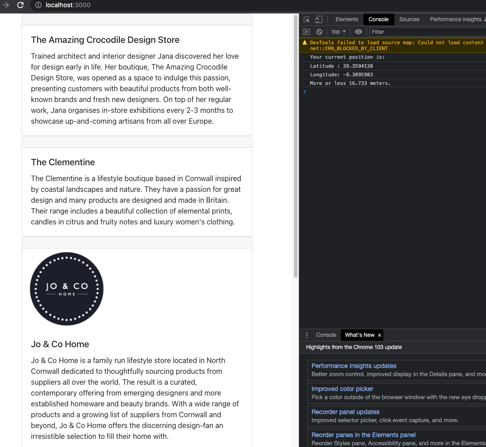

<h1>How I did it</h1>

To begin with my plan was this: 

1. Will use React and Bootstrap (as it is just an MVP). 

2. Google to find a way to calculate Distance.  

3. On Load, ask for location data. Save in Local State.

2. Also, onn Load,  fetch from API and save it in Local State. 

3. Calculate nearest stores. 

4. Show the 5 nearest stores. 

However, I quickly ran into CORS issues. So I decided to build a small backend as well. See below how I ended up making it:

1. On load, I am fetching data from the api via a proxy endpoint that I have set up. Please see the file named "backend". You need to have that running for it to work. You can start it by typing "npm run dev" in the backend's terminal. I made the backend to avoid CORS issues.

2. Once the backend is running, you can start the frontend by typing "npm start" in the terminal.

3. I am using a formula "pythagoreanDistanceBetweenPoints" (https://henry-rossiter.medium.com/calculating-distance-between-geographic-coordinates-with-javascript-5f3097b61898) to measure the distance from the users current location to shops in the array.

4. That distance is then added to the state called "mergedArray".

5. I am then sorting the array on min to max distance, and I am only showing the 5 nearest shops on the component called RenderedCards.

<h5>Technologies used:</h5>

React

NodeJs(for the backend)

ExpressJs (for the backend)

<h3>Image:</h3>
 
